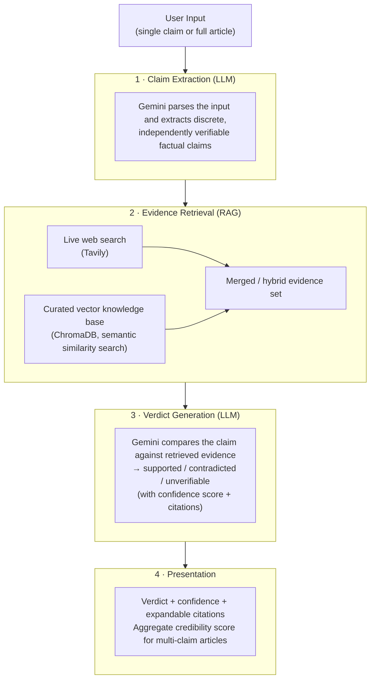
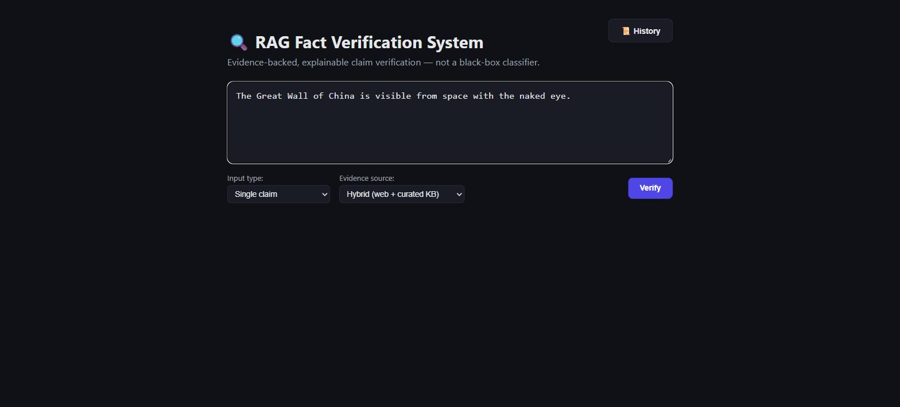
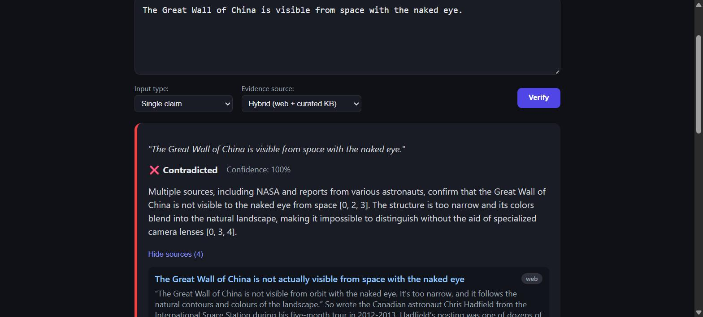

# 🔍 RAG-Based Fact Verification System

An AI-powered fact-checking pipeline that uses **Retrieval-Augmented Generation (RAG)** to verify claims against real-world evidence — producing transparent, source-cited verdicts instead of a black-box "real/fake" classification.

## Problem Statement

The rapid spread of misinformation makes manual fact-checking slow and unscalable. Most automated solutions rely on binary text classifiers trained on static datasets, which learn superficial patterns rather than verifying claims against actual evidence — making them prone to bias and opaque in how a verdict is reached.

This system instead retrieves real evidence for a claim and asks an LLM to reason over that evidence explicitly, producing a verdict, a confidence score, and cited sources — making the process explainable.

## How It Works (RAG Pipeline)



Each stage maps directly to a backend service — see [Architecture](#architecture) below for the corresponding files.

1. **Claim Extraction** (`services/claimExtraction.js`) — Gemini parses the raw input and pulls out discrete, independently verifiable factual claims.
2. **Evidence Retrieval** (`services/webSearchRetrieval.js`, `services/vectorStore.js`, `services/evidenceRetrieval.js`) — each claim is checked against live web search results (Tavily) and a curated vector knowledge base (ChromaDB), merged into a single hybrid evidence set.
3. **Verdict Generation** (`services/verdictGeneration.js`) — Gemini reasons over the claim + evidence and returns a verdict (`supported` / `contradicted` / `unverifiable`), a confidence score, and cited sources.
4. **Presentation** — the frontend renders the verdict, confidence, and expandable citations per claim, plus an aggregate credibility score (`services/aggregateScore.js`) when verifying a full article.

## Features

- **Single-claim verification** — paste any claim, get a sourced verdict
- **Full-article verification (multi-claim)** — automatically breaks an article into individual claims, fact-checks each one, and computes an overall credibility score
- **Hybrid evidence retrieval** — merges live web search results with a curated, domain-specific vector knowledge base
- **Explainable verdicts** — every verdict includes a confidence score, a reasoning paragraph, and expandable source citations (tagged by origin: `web` or `vector_kb`)
- **Query history** — every verification is persisted to MongoDB and viewable in-app

## Project Phases

| Phase   | Scope                                                                                                         | Status      |
| ------- | ------------------------------------------------------------------------------------------------------------- | ----------- |
| Phase 1 | Single-claim verification via live web search                                                                 | ✅ Complete |
| Phase 2 | Curated vector knowledge base (ChromaDB) for domain-specific evidence, merged with live search in hybrid mode | ✅ Complete |
| Phase 3 | Multi-claim article breakdown with aggregate credibility scoring                                              | ✅ Complete |

## Tech Stack

**Frontend**

- React 18 + Vite
- Axios for API calls

**Backend**

- Node.js + Express
- Google Gemini API (`@google/genai`) — claim extraction, verdict generation, and text embeddings
- Tavily API — live web search evidence retrieval
- ChromaDB — vector database for curated, domain-specific knowledge base
- MongoDB + Mongoose — query history persistence

## Architecture

```
fact-check-rag/
├── backend/
│   ├── server.js                    # Express entry point
│   ├── config/
│   │   ├── db.js                    # MongoDB connection
│   │   └── geminiClient.js          # Gemini API wrapper (JSON generation, embeddings, retry logic)
│   ├── routes/
│   │   └── verify.js                # /verify, /verify-article, /history, /kb/add endpoints
│   ├── services/
│   │   ├── claimExtraction.js       # Stage 1: extract claims from input
│   │   ├── webSearchRetrieval.js    # Stage 2a: live web search (Tavily)
│   │   ├── vectorStore.js           # Stage 2b: curated KB (ChromaDB)
│   │   ├── evidenceRetrieval.js     # Merges web + vector evidence (hybrid mode)
│   │   ├── verdictGeneration.js     # Stage 3: LLM verdict + citations
│   │   └── aggregateScore.js        # Phase 3: multi-claim credibility scoring
│   ├── models/
│   │   └── QueryHistory.js          # MongoDB schema for past queries
│   └── scripts/
│       └── seedKnowledgeBase.js     # Populates the curated vector KB
└── frontend/
    └── src/
        ├── App.jsx
        ├── api/
        │   └── verify.js            # API client
        └── components/
            ├── ClaimInput.jsx
            ├── VerdictCard.jsx
            ├── CitationList.jsx
            ├── AggregateScore.jsx
            └── HistoryPanel.jsx
```

**Request flow:** `App.jsx` → `api/verify.js` → `routes/verify.js` → `claimExtraction.js` → `evidenceRetrieval.js` (fans out to `webSearchRetrieval.js` + `vectorStore.js`) → `verdictGeneration.js` → (`aggregateScore.js` for articles) → persisted via `QueryHistory.js` → rendered by `VerdictCard.jsx` / `CitationList.jsx` / `AggregateScore.jsx`.

## Setup & Installation

### Prerequisites

- [Node.js](https://nodejs.org) 18+
- [Python](https://www.python.org/downloads/) 3.10+ (for running ChromaDB)
- A [MongoDB](https://www.mongodb.com/cloud/atlas/register) database (Atlas free tier or local)
- API keys: [Gemini](https://aistudio.google.com/apikey), [Tavily](https://tavily.com)

### 1. Clone the repository

```bash
git clone https://github.com/yourusername/rag-fact-verification-system.git
cd rag-fact-verification-system
```

### 2. Backend setup

```bash
cd backend
npm install
cp .env.example .env
```

Fill in `.env` with your MongoDB URI, Gemini API key, and Tavily API key.

### 3. Start ChromaDB (vector database)

```bash
pip install chromadb
chroma run --path ./chroma-data --port 8000
```

### 4. Seed the curated knowledge base

```bash
npm run seed
```

### 5. Start the backend

```bash
npm run dev
```

Runs on `http://localhost:5000`.

### 6. Frontend setup (in a new terminal)

```bash
cd frontend
npm install
npm run dev
```

Runs on `http://localhost:5173`.

## API Endpoints

| Method | Endpoint              | Description                                                         |
| ------ | --------------------- | ------------------------------------------------------------------- |
| `POST` | `/api/verify`         | Verify a single claim                                               |
| `POST` | `/api/verify-article` | Extract and verify all claims in an article, return aggregate score |
| `GET`  | `/api/history`        | Fetch recent verification queries                                   |
| `POST` | `/api/kb/add`         | Add a document to the curated vector knowledge base                 |
| `GET`  | `/api/health`         | Health check                                                        |

## Example

**Input:** `"The Great Wall of China is visible from space with the naked eye."`

**Output:**

```json
{
  "verdict": "contradicted",
  "confidence": 100,
  "reasoning": "Multiple sources, including NASA and astronaut accounts, confirm the Great Wall is not visible to the naked eye from space due to its narrow width and coloring blending with the landscape.",
  "citations": [
    { "title": "NASA — Common Misconceptions", "url": "...", "source": "web" }
  ]
}
```

### Screenshots

| Input | Output |
| --- | --- |
|  |  |
| Pasting a claim and choosing the hybrid (web + curated KB) evidence source | Resulting verdict, confidence score, reasoning, and expandable source citations |

## Why RAG Instead of a Classifier?

Traditional fake-news classifiers output a label with no justification, learned from patterns in a static training set that quickly go stale and can encode dataset bias. This system instead retrieves live, current evidence for each specific claim and has the LLM reason over that evidence transparently — every verdict is traceable to real, cited sources, and the system's knowledge isn't frozen at a training cutoff.

## Author

Built as an applied AI systems project — combining LLM orchestration, retrieval-augmented generation, and evidence-based reasoning, extending prior experience integrating the Gemini API into full-stack applications.
